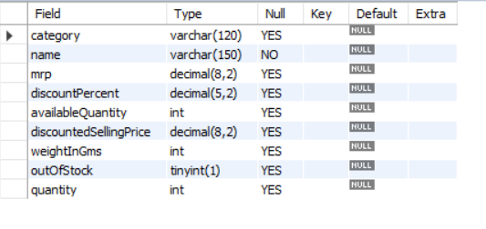
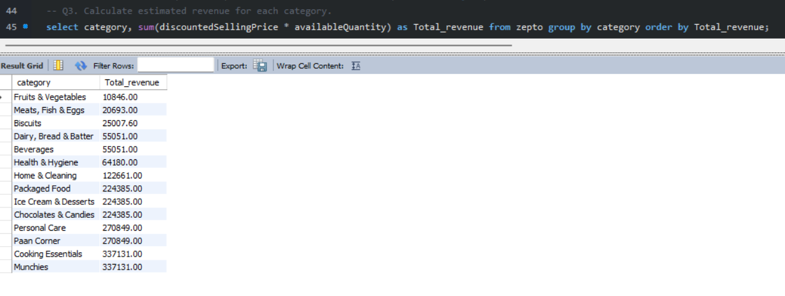
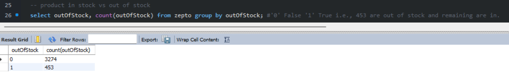

# Zepto Data Analysis using MySQL

## Overview
This project involves analyzing  Zepto products dataset using **MySQL**.  
The main objective was to explore the data, clean it where required, and run SQL queries to extract useful insights related to pricing, discounts, stock availability, and product categories.

This project showcases practical **SQL querying and debugging skills** using a real-world dataset.

---

## Dataset
- Format: CSV
- Contains details such as:
  - Product name
  - Category
  - MRP
  - Discount percentage
  - Discounted selling price
  - Available quantity
  - Weight
  - Stock status

---

## Tools Used
- MySQL  
- SQL  
- CSV Dataset  

---

## What Was Done
- Imported the Zepto CSV dataset into MySQL
- Explored the dataset structure and records
- Checked for null values
- Wrote SQL queries to analyze:
  - Product categories
  - Discounts and pricing
  - Stock availability
  - Weight-based product insights

All queries are available in the `Dataset_zepto.csv` file.

---

## Issues Faced & Learnings
- Faced errors while running some queries due to:
  - Incorrect assumptions about column data types
  - Boolean values (`outOfStock`) behaving differently in MySQL
- Resolved them by:
  - Verifying table schema
  - Modifying query conditions
  - Testing queries step by step

This improved my understanding of **schema validation and SQL debugging**.

---

## Screenshots
Below are a few screenshots from the project execution:

### 1. Table Structure

### 2. Sample SQL Query & Output

### 3. Data Analysis Result

---

## Project Files
- `Dataset_zepto.csv` – Raw dataset  
- `zepto_Queries.sql` – SQL queries used for analysis  

---

## Key Takeaway
This project strengthened my SQL fundamentals by working with real data, handling query errors, and extracting meaningful insights using MySQL.
